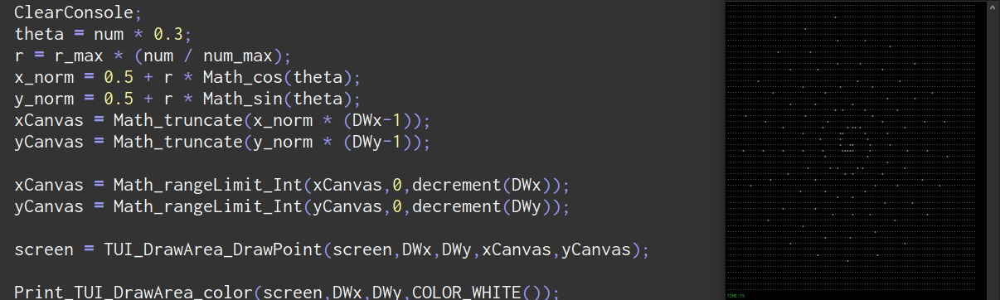

# Pseudo Lib: Objects, Graphics & Libraries


### Estadísticas del Proyecto
PseudoLib es una extensa biblioteca de pseudo-código escrita en PSeInt que implementa estructuras de datos, utilidades matemáticas, manipulación de strings, interfaces de usuario y funcionalidades similares a lenguajes de programación modernos. Este proyecto es un esfuerzo para llevar las capacidades de PSeInt más allá de sus límites tradicionales, implementando conceptos de programación moderna en un entorno educativo. 



Total de funciones: ~340 funciones organizadas en módulos

Versión: PSeInt 2023+

Estado: En desarrollo activo

---

## Estructura del Proyecto
```
Pseudo_Lib
├── MAIN (#0) - Función principal
├── INPUT (#1) - Entrada de usuario
├── STRING (#2) - Manipulación de strings
├── ARRAY (#3) - Arreglos
├── PRINTERS (#4) - Sistema de impresión
├── INT (#5) - Enteros y binarios
├── MATH (#6) - Matemáticas
├── BOOLEAN (#7) - Booleanos
├── CONDITIONS (#8) - Condiciones
├── DEFINITIONS (#9) - Definiciones
├── COLOR (##0) - Colores
├── LOCAL DATE TIME (##1) - Fecha/hora
├── UTIL (##2) - Utilidades y colecciones
│   ├── COLLECTION - Colecciones base
│   ├── LINEARCOLLECTION - Colecciones lineales
│   ├── DEQUE - Doble cola
│   ├── QUEUE - Cola
│   ├── STACK - Pila
│   ├── LIST - Lista
│   ├── MAP - Mapa
│   ├── LIST OFFSET - Lista con offset
│   └── SET - Conjunto
├── OBJECT (##3) - Objetos
├── TUI/CANVAS (##4) - Interfaz gráfica
├── VEC (##5) - Vectores
└── ASCII (##6) - Caracteres ASCII
```

---

## Próximamente / En desarrollo

- Estructuras de datos avanzadas: **Map, Set**  
- Algoritmos de ordenamiento: **QuickSort, BubbleSort, MergeSort**  
- Transformaciones gráficas 2D y soporte 3D  
- Reescritura de **Vec**: optimización y mejoras de helpers  
- Reescritura de **Object**: optimización y agregado de objetos internos   
- mejoras en los helpers de funciones de Local_Date_Time y Duration

> la mayoria de cosas complejas se manejan mediante asignaciones y texto
> es simulacion con el objetivo de programar cosas complejas con flexibilidad 
