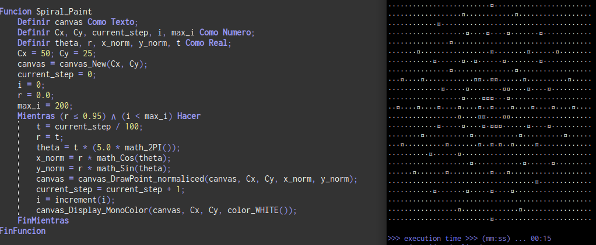
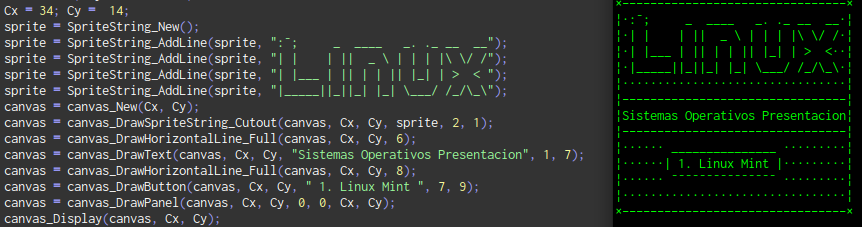

# Pseudo Lib: Objects, Graphics & Libraries

### Acerca del Proyecto
PseudoLib es una infraestructura integral de pseudo-código desarrollada para PSeInt. Su objetivo es romper las limitaciones del entorno educativo, emulando la arquitectura y robustez de una librería estándar profesional (inspirada Java, C y JavaScript).
> [!IMPORTANT]
> Este proyecto no tiene un fin pedagógico básico. Es una implementación técnica de naturaleza experimental. Para su correcta integración y aprovechamiento, se requiere comprensión previa de ciertos conceptos de programación.

> Spirtal Demostracion

> poder de dibujo con TUI o Canvas

---
## Módulos del Sistema

| NAME MODULE              | USE                          | STATE |
| :----------------------- | :--------------------------- | :---: |
| INPUT                    | `user_input_`                |  `[+]` |
| STRING                   | `string_`                    |  `[+]` |
| ARRAY                    | `array_`                     |  `[p]` |
| PRINTERS                 | `print_ : prinln_`           |  `[p]` |
| SLEEP                    | `sleep_`                     |  `[+]` |
| LOGS                     | `log_`                       |  `[+]` |
| TEST                     | `test_`                      |  `[+]` |
| INT                      | `int_`                       |  `[+]` |
| BINARY_STRING            | `binarystring_`              |  `[+]` |
| MATH                     | `math_`                      |  `[+]` |
| BOOLEAN                  | `boolean_`                   |  `[+]` |
| CONDITIONS               | `if_ : condition_`           |  `[+]` |
| COLOR                    | `COLOR_`                     |  `[+]` |
| VALUE                    | `value_`                     |  `[+]` |
| COLLECTION               | `collection_`                |  `[+]` |
| MANAGERs_DATA            | `managerData_`               |  `[+]` |
| LINEAR_COLLECTION        | `linearCollection_`          |  `[+]` |
| DEQUE                    | `util_deque_`                |  `[+]` |
| QUEUE                    | `util_queue_`                |  `[+]` |
| STACK                    | `util_stack_`                |  `[+]` |
| TEMPORAL\CHRONO_UNIT     | `localDate_time_`            |  `[+]` |
| LOCALDATE                | `localDate_`                 |  `[+]` |
| LOCALTIME                | `localTime_`                 |  `[+]` |
| LOCALDATE_TIME           | `localDate_time_`            |  `[+]` |
| DURATION                 | `duration_`                  |  `[+]` |
| PERIOD                   | `period_`                    |  `[+]` |
| LIST                     | `util_List_`                 |  `[+]` |
| COLLECTION_STORAGE       | `collectionStorage_`         |  `[+]` |
| CELLS_COLLECTION         | `cellsCollection_`           |  `[+]` |
| CELLS_COLLECTION_DYNAMIC | `cellsCollection_dynamic_`   |  `[+]` |
| CELLS_COLLECTION_SETTER  | `cellsCollection_setter_`    |  `[+]` |
| SET                      | `util_set_`                  |  `[+]` |
| DUAL_CELLS_COLLECTION    | `collectionDualCells_`       |  `[+]` |
| STORAGE_CELLS_COLLECTION | `collStorageCells_`          |  `[p]` |
| MAP                      | `util_map_`                  |  `[+]` |
| OBJECTS                  | `object_`                    |  `[+]` |
| CANVAS                   | `canvas_`                    |  `[+]` |
| SPRITE                   | `sprite_`                    |  `[+]` |
| TUI                      | `tui_`                       |  `[+]` |
| TCOMPONENT               | `tComponent_`                |  `[+]` |
| VEC                      | `vec_`                       |  `[x]` |
| ASCII/HASH               | `ascii_`                     |  `[+]` |

> [!NOTE]
> -  ~9600 lines | `pseint.2023` | 41 modules
---

#### State module

| STATE | DESCRIPTION                                 |
| :---: | :------------------------------------------ |
| `[+]` | Stable                                      |
| `[D]` | Current Development (Unusable temporarily)  |
| `[p]` | Stable (Pending additions)                  |
| `[x]` | Unusable / undeveloped state                |

---
---

## Próximamente / En desarrollo

- Algoritmos de ordenamiento de arreglos compatibles con la estructura String 
- Vectores Cruz y Punto a partir de Cadenas y arreglos
- Regex(Pattern/Matcher)
- QR

> [!NOTE]
> la mayoria de cosas complejas se manejan mediante asignaciones y texto
> es simulacion con el objetivo de programar cosas complejas con flexibilidad 
